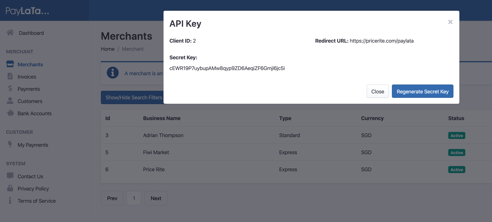

# Introductions

The "**PayLata**" API is a REST based API that allows merchants to integrate PayLata into their web platform.

In order to use the API a merchant account must be created at http://www.paylata.com. Create a new "**Express**" merchant record which will generate a "**Client Id**" and "**Secret Key**" which are needed to authenticate and generate "**access tokens**" that are used to access the various available endpoints.

